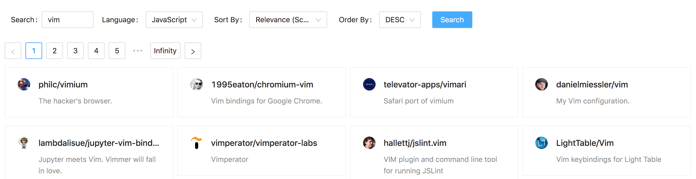

# Github Repository Browser

<p align="center">
  
</p>

This project consists of a React web app and an Express server which returns data fetched from the Github API. You can filter repos by language and search term, and sort by stars or score. You can also see deatils about each particular repo, such as stargazers, watchers, and forks.

## Requirements
I've been using lts versions of Node. Any recent version should work but if you have problems with installation, try one of these:
```console
lts/dubnium -> v10.22.0
lts/erbium -> v12.18.3
```

## Installation

To run this app yourself, you'll first need to clone this repository:

```bash
git clone https://github.com/willpiers/github-browser
```

Because the project is currently only set up to run in development, you'll have to run both the express server and the webpack development server for the client. In separate windows/panes/tabs you'll run the following from the root:

```bash
cd server
npm install
npm start
```
and

```bash
cd client
npm install
npm start
```

At this point you should be up and running. Happy browsing!

## Tests
There are no tests at this time.


## License
[MIT](https://choosealicense.com/licenses/mit/)
